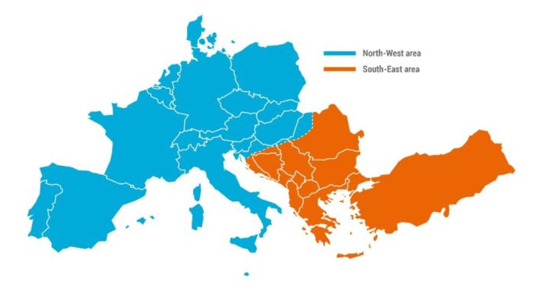
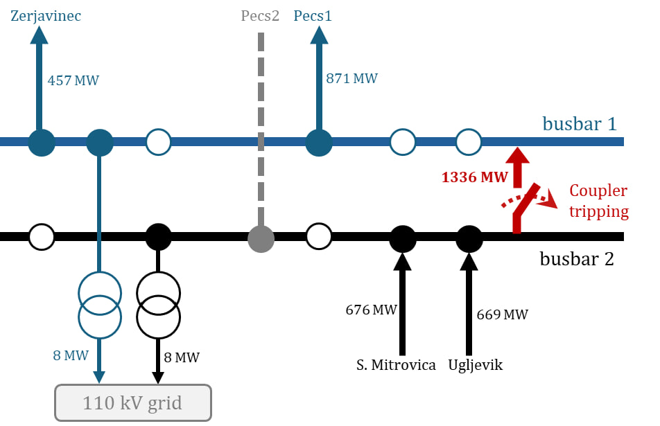

🚧 Code release in progress
# Security-Constrained Substation Reconfiguration

This repository contains the code accompanying the paper:

Ali Rajaei, Jochen L. Cremer,  
**"Security-Constrained Substation Reconfiguration considering Busbar and Coupler Contingencies"**,  
IEEE Transactions on Power Systems, 2026.


**Ali Rajaei et al.**  
*Security-Constrained Substation Reconfiguration considering Busbar and Coupler Contingencies*  
IEEE Transactions on Power Systems, 2026.

---

## Motivation

On **January 8, 2021**, the European power system experienced a major disturbance that split the continental grid into two areas.  
The event was triggered by the **tripping of a highly loaded busbar coupler**, which led to cascading failures across the network.

The post-event analysis showed that the **substation topology had not been adjusted after a transmission line outage**, and the **coupler contingency had not been included in the N-1 security analysis**.

This incident highlights the importance of explicitly considering **substation elements such as busbars and couplers** when determining secure grid configurations.

<p align="center">

</p>

*European system split on January 8, 2021 (adapted from ENTSO-E report).*

<p align="center">

</p>

*Illustration of the substation topology involved in the event (adapted from ENTSO-E).*

To address this challenge, our work proposes a **security-constrained substation reconfiguration framework** that considers **line, coupler, and busbar contingencies**, while remaining computationally scalable for large power systems.

---

## Repository Status

🚧 **Code under preparation**

The implementation used in the paper is currently being prepared for public release.  
The repository will be updated soon with:

- implementation of the proposed **SC-SR formulation**
- the **HMMP heuristic algorithm**
- example scripts for the IEEE benchmark systems
- instructions to reproduce the results in the paper

---

## Citation

If you use this work in your research, please cite:
@article{rajaei2026security,
  title={Security-Constrained Substation Reconfiguration Considering Busbar and Coupler Contingencies},
  author={Rajaei, Ali and Cremer, Jochen L},
  journal={IEEE Transactions on Power Systems},
  year={2026}
}

```bash
python run_sc_sr.py --case ieee118
